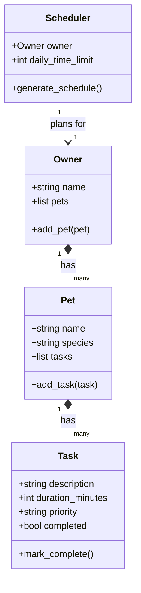

# PawPal+ System Architecture

```mermaid
classDiagram
    class Owner {
        +string name
        +list pets
        +add_pet(pet)
    }
    class Pet {
        +string name
        +string species
        +list tasks
        +add_task(task)
    }
    class Task {
        +string description
        +int duration_minutes
        +string priority
        +bool completed
        +mark_complete()
    }
    class Scheduler {
        +Owner owner
        +int daily_time_limit
        +generate_schedule()
    }

    Owner "1" *-- "many" Pet : has
    Pet "1" *-- "many" Task : has
    Scheduler "1" --> "1" Owner : plans for
```
